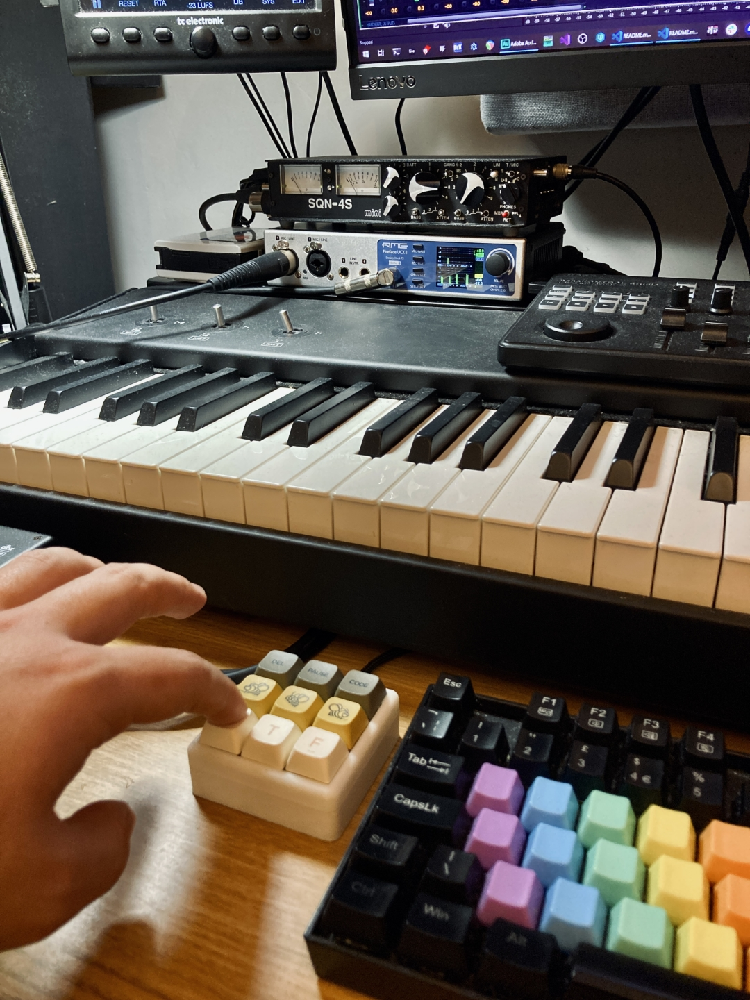

# AHK TotalMix Remote
 Control RME's TotalMix software for its Fireface/Babyface/MADIface audio interfaces with keyboard shortcuts via AutoHotkey and OSC

# About
I wanted to use my 9-key RPi Pico-based macro pad (a tiny USB HID keyboard) to quickly control some TotalMix functionality without having to reach over to my UCX-II. RME sell a hardware USB remote called the ARC, but it's too big and unwieldy for my workflow.

My macro pad is programmed to emit very dense keystroke combos e.g. RightCtrl+RightShift+RightAlt+F7 which are very unlikely to clash with anything else, and these are caught by an AutoHotkey script which uses a fantastic little AHK-OSC bridge DLL by Ludwig Frühschütz to generate OSC (Open Sound Control) messages which are sent to TotalMix. OSC is a network protocol, but since we send to 127.0.0.1 (localhost loopback) TotalMix receives it just as it would from any other network host.

Now I can very easily (and globally, regardless of which application has focus) do things like toggle a certain analogue input's mute state, toggle main out muting, headphone mute, mono collapse, main speaker A/B selection, and so on.

I'm documenting this mostly for my own future reference, and because deciphering RME's documentation was quite a frustrating, unintuitive process. Hopefully it'll help somebody else.

# Setup

You'll need:

* A TotalMix-compatible RME audio interface, e.g. Fireface UCX I/II, Babyface, MADIface (the list is long - check their site), with TotalMix installed

* RME's documentation for its OSC implementation: http://www.rme-audio.de/downloads/osc_table_totalmix_new.zip

* AutoHotkey installed: https://www.autohotkey.com/

* The DLL and setup documentation for OSC2AHK: https://files.eleton-audio.de/gitea/Ludwig/OSC2AHK

## AutoHotkey setup
* The AutoHotkey script (totalmix-osc.ahk) and OSC2AHK.dll should be placed in the same directory. Mine are in %userprofile%

* Once AutoHotkey is installed, you can right-click the script and click 'Run script'. 

* To run the script every time you start Windows, type shell:startup at the Windows Run prompt to open your Start-up folder; in here you can place a shortcut to the .ahk script.

## TotalMix setup

* First go to Options -> Settings. In the OSC tab, select Remote Controller 1 and ensure 'In Use' is ticked.

* I have 'Port incoming' set to 7001, as per the 'port' value in the AHK script. Port outgoing is 9001, but that's not important to us.

* Leave 'Remote Controller Address' blank - this is important!

* Click OK

* Go to Options -> Channel Layout. Here, if you want to target controls on a specific channel with minimum fuss, it's a good idea to go through Inputs, Playbacks and Outputs and tick 'Hide Channel in: OSC Controller 1' for every channel you're not interested in. This means that the addressable channel block for OSC control is compressed to only the ones you want, with the channels renumbered accordingly. 

* For example, I want to toggle input mute on Analogue 5, where my voice chat mic is plugged in. But because Analogue 3/4 are joined in Stereo mode, Analogue 5 has to be addressed as Channel 4. That's ok, but for some reason I can't address a toggle instruction to Channel 4, so I need to use two keys - one to send a float value of 1.0, and one to send 0.0. That's a waste of my macro pad keys! So by hiding Analogues 1,2, and 3/4, I can  construct an OSC message addressed to '/2/mute', where 2 is the page number in RME's documentation spreadsheet; page 2 contains detailed commands for each channel and either you stack OSC messages to first select the channel (not sure how to do that in the AHK script) or it defaults to the 'first' channel. If I've hidden channels 1 to 3/4, then the first channel is...5! Awesome, now I can use the toggle instruction type to toggle my mic mute with a single key.

* The other examples in my script are slightly less baffling, since it's relatively easy to switch between A and B speakers ('/1/mainSpeakersB'); to recall your default output volume ('/1/mainRecall'); and to toggle mono-collapse of the main output ('/1/mainMono') but...

* For some reason, it doesn't seem like there's a dedicated OSC address to toggle muting of the main output - a feature I use hundreds of times a day and to which I'm able to bind one of my UCX II's front surface buttons. The best I've been able to come up with is to create - in TotalMix - a Mute Group that toggles mute on Main and Main B (my B speakers), which are addressed via '/3/muteGroups/x/1' where x is...the group number you want but inverted?! Sure RME, why not. So my speaker mute group is Group 1, and my address is '/3/muteGroups/4/1'. My headphones mute group is Group 2, so the address for that is '/3/muteGroups/3/1'. 

* Finally...in TotalMix, tick Options -> Enable OSC Control. And hopefully you're up and running! I didn't have any issues with needing to run the script in administrator mode, or with Windows firewall on the loopback; hopefully you won't either, but those are good places to look if things don't seem to work.

# Notes

Depending on how you want to trigger the AutoHotkey script, you might need to tweak it a bit. Spend some time on the AHK docs and searching its decades' worth of forum posts where lots of people have probably already answered whatever question you have. 

Here's the code I'm using for my macro pad (although for my TotalMix controller I don't use the boot.py): https://github.com/echolevel/macro-pad

Many thanks to Ludwig Frühschütz for writing the OSC2AHK library!